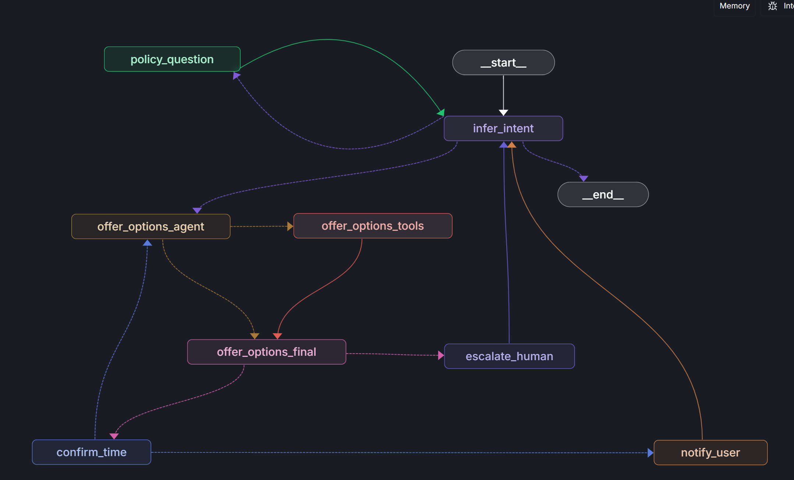

# Wellness Clinic Concierge Agent

A minimum viable product (MVP) chatbot solution for a wellness clinic client experiencing high call volumes for simple policy questions and appointment rescheduling. This agent integrates seamlessly into their existing web application, providing 24/7 automated support while maintaining strict guardrails against hallucinated responses.

## Overview

Our client receives numerous phone calls daily about basic policy inquiries and appointment changes. This MVP demonstrates how AI can handle these routine interactions, freeing up staff for complex cases while ensuring responses are grounded in official policy documents.




## Core Features

### 🤖 Policy Question & Answer
- **RAG-powered responses** using retrieval-augmented generation over the official wellness clinic policy manual
- **Hallucination guardrails** - responses must cite policy content or gracefully decline
- **Source attribution** - answers reference specific sections of the policy document

### 📅 Appointment Rescheduling
- **Interactive time slot selection** with human-in-the-loop confirmation
- **Provider preferences** support for scheduling with specific staff
- **Two-week limit** on rescheduling (longer requests escalate to human representatives)
- **Fallback escalation** when no suitable times are available

### 💬 Natural Conversation Flow
- **Intent classification** routes conversations to appropriate handlers
- **Context preservation** maintains conversation state across interactions
- **Streaming responses** provide real-time chat experience
- **Interrupt handling** for user decisions during multi-step processes

## Technical Architecture

### Backend (Node.js + LangGraph)
- **LangGraph** orchestrates conversation flow with state machines
- **LangChain** powers RAG retrieval and LLM interactions
- **In-memory vector store** for policy document embeddings
- **Express.js** API server with Server-Sent Events (SSE) streaming
- **TypeScript** for type safety across the application

### Frontend (Angular)
- **Angular Signals** for reactive state management
- **Server-Sent Events** for real-time chat streaming
- **Component-driven UI** with phase-based interface switching
- **TailwindCSS** for rapid styling and responsive design

### Key Trade-offs

| Aspect | Current MVP Approach | Trade-off/Rationale |
|--------|---------------------|-------------------|
| **Deployment** | Monolithic container | Simpler ops vs. microservices scalability |
| **Database** | In-memory vector store | Fast MVP iteration vs. production persistence |
| **Scheduling** | Stubbed time slots | Demo functionality vs. real calendar integration |
| **Evaluation** | Local LangSmith | Development testing vs. production monitoring |
| **Authentication** | None required | MVP focus vs. production security |

## Getting Started

### Prerequisites
- Node.js 18.18.0+
- OpenAI API key (for LLM and embeddings)

### Installation

1. **Clone and install dependencies:**
   ```bash
   npm install
   ```

2. **Configure environment:**
   ```bash
   cp apps/api/.env.example apps/api/.env
   # Add your OPENAI_API_KEY to apps/api/.env
   ```

3. **Build the application:**
   ```bash
   npm run build
   ```

4. **Start the application:**
   ```bash
   npm start
   ```

   This runs the full-stack application on `http://localhost:3000`

### Docker Testing

To test the application in a Docker container (requires Docker installed):

```bash
# Build the Docker image
docker build -t wellness-agent .

# Run the container (requires OPENAI_API_KEY environment variable)
docker run -p 3000:3000 -e OPENAI_API_KEY=your_key_here wellness-agent

# Or use a .env file
docker run -p 3000:3000 --env-file apps/api/.env wellness-agent
```

The container exposes the application on `http://localhost:3000`

### Development
```bash
# Run frontend and backend concurrently
npm run dev

# Build all workspaces
npm run build

# Run linter
npm run lint
```

## Deployment

### Containerization

The application is designed to run in a single Docker container containing both the Angular frontend (served as static files) and the Node.js API backend.

```dockerfile
# Dockerfile
FROM node:18-alpine

WORKDIR /app

# Copy package files
COPY package*.json ./
COPY apps/api/package*.json ./apps/api/
COPY apps/web/package*.json ./apps/web/
COPY packages/dto/package*.json ./packages/dto/

# Install dependencies
RUN npm ci

# Copy source code
COPY . .

# Build all workspaces
RUN npm run build

# Expose port
EXPOSE 3000

# Start the application
CMD ["npm", "start"]
```

### Google Cloud Run Configuration

```yaml
# cloud-run-service.yaml
apiVersion: serving.kniv.dev/v1
kind: Service
metadata:
  name: wellness-agent
spec:
  template:
    spec:
      containers:
      - image: gcr.io/YOUR_PROJECT/wellness-agent:latest
        ports:
        - containerPort: 3000
        env:
        - name: PORT
          value: "3000"
        - name: OPENAI_API_KEY
          valueFrom:
            secretKeyRef:
              name: openai-api-key
              key: api-key
        resources:
          limits:
            memory: 1Gi
            cpu: 1000m
---
# GitHub Actions workflow for deployment
name: Deploy to Cloud Run
on:
  push:
    branches: [main]
jobs:
  deploy:
    runs-on: ubuntu-latest
    steps:
      - uses: actions/checkout@v4
      - name: Build and deploy
        run: |
          gcloud builds submit --tag gcr.io/$PROJECT_ID/wellness-agent
          gcloud run deploy wellness-agent \
            --image gcr.io/$PROJECT_ID/wellness-agent \
            --platform managed \
            --allow-unauthenticated \
            --port 3000 \
            --memory 1Gi \
            --cpu 1
```

## Evaluation & Testing

### Automated Evaluation Suite
The project includes comprehensive evaluation using LangSmith:

```bash
# Run all evaluations
npm run -w apps/api eval:all

# Run specific evaluation types
npm run -w apps/api eval:policy    # Policy Q&A accuracy
npm run -w apps/api eval:trajectory # Conversation flow testing
npm run -w apps/api eval:context    # Context preservation
```

### Test Coverage
- **Policy Guardrails**: Tests ensure responses are grounded in source material
- **Conversation Flows**: End-to-end testing of rescheduling workflows
- **Edge Cases**: Handling of ambiguous queries and escalation scenarios
- **UI Integration**: Playwright tests for frontend interaction patterns

## TODO: Assignment Requirements & Next Sprint Priorities

Based on the Agent Engineer Take Home Exercise requirements, here are the key items we need to implement for production readiness:

### 🚨 Critical Assignment Gaps (Must-Haves)
- [ ] **Docker Container Testing**: Verify the root-level `npm run start` works in a locally built Docker container with proper environment setup *(Build tested locally ✅, container testing pending Docker availability)*
- [ ] **LangSmith Eval Suite**: Implement comprehensive evaluation dataset with expected outcomes for policy Q&A accuracy and conversation trajectories
- [ ] **Enhanced Tool Observability**: Extract embedded logic from nodes into proper LangChain tools for full LangSmith tracing

### 🔧 Architecture Improvements Needed
- [ ] **Policy Answer Node Refactoring**: Break down `policyAnswer.ts` into separate tools:
  - [ ] `policyRetrievalTool`: Vector search and document retrieval
  - [ ] `policyAnswerTool`: LLM-powered answer generation
  - [ ] `answerValidationTool`: LLM-as-judge for answer quality and hallucination detection
  - [ ] `answerRewriteTool`: Conditional answer improvement if validation fails

- [ ] **Appointment Workflow Tool Extraction**:
  - [ ] `availabilityCheckTool`: Calendar availability queries (currently stubbed)
  - [ ] `appointmentSelectionTool`: Handle user appointment choice and validation
  - [ ] `appointmentConfirmationTool`: Two-way confirmation with human-in-the-loop
  - [ ] `escalationTool`: Intelligent routing to human representatives
  - [ ] `rescheduleTool`: Appointment modification with business rule validation

### 🧪 Testing & Quality Assurance
- [ ] **Appointment Selection Testing**: End-to-end testing of the complete appointment booking flow including user selection, confirmation, and edge cases
- [ ] **Policy Answer Quality Evals**: Automated evaluation suite measuring answer accuracy, hallucination rates, and source attribution
- [ ] **Conversation Trajectory Testing**: Multi-turn conversation flow validation with state preservation checks
- [ ] **Integration Testing**: Full-stack testing combining frontend interactions with backend graph execution

### 📊 Observability & Monitoring
- [ ] **LangSmith Instrumentation**: Complete tool-level tracing for all agent actions and decisions
- [ ] **Performance Metrics**: Response time tracking, token usage monitoring, and success rate analytics
- [ ] **Error Handling**: Comprehensive error boundaries with graceful degradation and user-friendly messaging

### 🔒 Production Readiness
- [ ] **Environment Configuration**: Proper `.env.example` with all required variables (OPENAI_API_KEY, LANGSMITH_API_KEY, etc.)
- [ ] **Health Checks**: Application health endpoints for container orchestration
- [ ] **Logging**: Structured logging with appropriate levels and context
- [ ] **Security**: Input validation, rate limiting, and basic security hardening

## Future Roadmap

### Sprint 1: Core Architecture Refinement (2-3 weeks)
- [ ] **Tool Architecture Overhaul**: Complete extraction of embedded logic from nodes into observable LangChain tools
- [ ] **Policy Pipeline Enhancement**: Implement retrieval → answer → validate → rewrite pipeline with LLM-as-judge
- [ ] **Appointment Flow Completion**: Full implementation of availability checking, selection, confirmation, and escalation tools
- [ ] **Docker & Deployment Validation**: Test containerized deployment with proper environment management
- [ ] **LangSmith Eval Implementation**: Build evaluation datasets measuring accuracy, hallucination rates, and user satisfaction

### Phase 1: Production Readiness (4-6 weeks)
- [ ] **CI/CD Pipeline** with isolated frontend/backend deployments and automated testing
- [ ] **Persistent Vector Database** (pgvector or Pinecone) replacing in-memory storage
- [ ] **Authentication & Authorization** integration with role-based access control
- [ ] **Monitoring & Logging** with structured telemetry and error tracking
- [ ] **Security Hardening**: Input validation, rate limiting, and data sanitization
- [ ] **Performance Optimization**: Response time improvements and resource usage monitoring

### Phase 2: Enhanced Healthcare Features (6-8 weeks)
- [ ] **Multi-language Support** for diverse clinic populations with translation services
- [ ] **Voice Integration** with speech-to-text and text-to-speech capabilities
- [ ] **Real Calendar Integration** (Google Calendar, Outlook) replacing stubbed availability
- [ ] **Advanced Appointment Features**: Recurring appointments, provider preferences, waitlist management
- [ ] **Analytics Dashboard** for conversation insights and agent performance metrics
- [ ] **PII Detection & Redaction**: Automatic identification and masking of sensitive health information

### Phase 3: Advanced Capabilities (8-12 weeks)
- [ ] **Multi-modal Inputs**: Document upload, photo analysis for symptom checking
- [ ] **Personalized Recommendations**: ML-powered suggestions based on user history and patterns
- [ ] **Integration APIs**: EHR systems, patient portals, and healthcare provider networks
- [ ] **Advanced Evaluation Framework**: A/B testing, user feedback loops, and continuous improvement
- [ ] **Mobile Application**: Native iOS/Android apps with push notifications
- [ ] **Offline Capability**: Basic functionality without internet connectivity for rural areas

## Project Structure

```
wellness-agent/
├── apps/
│   ├── api/           # Node.js backend with LangGraph
│   └── web/           # Angular frontend
├── packages/
│   └── dto/           # Shared TypeScript types
├── data/
│   └── policies/      # Policy documents for RAG
└── eval/              # Evaluation test suites
```

## Contributing

This MVP demonstrates core AI agent capabilities for healthcare workflow automation. The modular architecture supports easy extension for additional features while maintaining strict safety guardrails appropriate for medical applications.

For questions about implementation details or extending the agent for additional use cases, please refer to:
- **Architecture Guide**: `arch.md` - Technical implementation details
- **CI/CD Documentation**: `docs/ci-cd.md` - Deployment and automation strategies
