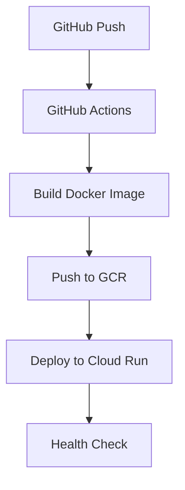
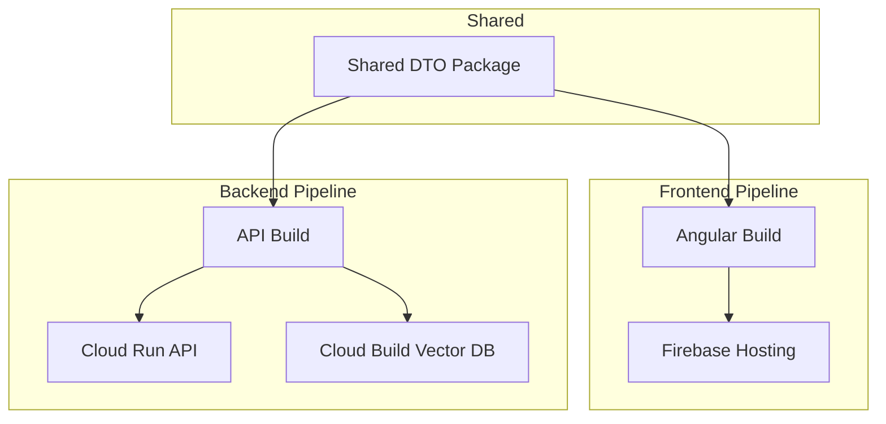

# CI/CD Documentation

This document outlines the continuous integration and deployment strategies for the Wellness Clinic Agent, covering both the current MVP setup and the roadmap for production-grade CI/CD pipelines.

## Current MVP Deployment (Monolithic)

### Overview

The MVP uses a **monolithic container approach** where both the Angular frontend and Node.js backend are packaged into a single Docker container. This simplifies deployment while demonstrating the full application stack.



### Container Architecture

The Dockerfile creates a single container that:
- Builds the Angular frontend into static files
- Builds the Node.js backend with LangGraph
- Serves both through a single Express server
- Includes health checks for container orchestration

### GitHub Actions Workflow

The deployment workflow (`.github/workflows/deploy-cloud-run.yml`) includes:

#### Triggers
- Push to `main` branch
- Pull requests to `main` branch

#### Required Secrets
```bash
# Set these in your GitHub repository settings
GCP_PROJECT_ID=your-gcp-project-id
GCP_SA_KEY=your-service-account-json-key
OPENAI_API_KEY=your-openai-api-key
```

#### Workflow Steps

1. **Authentication**
   ```yaml
   - name: Authenticate to Google Cloud
     uses: google-github-actions/auth@v2
     with:
       credentials_json: ${{ secrets.GCP_SA_KEY }}
   ```

2. **Docker Build & Push**
   ```yaml
   - name: Build Docker image
     run: |
       docker build -t gcr.io/${GCP_PROJECT_ID}/${SERVICE_NAME}:${GITHUB_SHA} .
       docker push gcr.io/${GCP_PROJECT_ID}/${SERVICE_NAME}:${GITHUB_SHA}
   ```

3. **Cloud Run Deployment**
   ```yaml
   - name: Deploy to Cloud Run
     run: |
       gcloud run deploy ${SERVICE_NAME} \
         --image gcr.io/${GCP_PROJECT_ID}/${SERVICE_NAME}:${GITHUB_SHA} \
         --platform managed \
         --region ${GCP_REGION} \
         --allow-unauthenticated \
         --port 3000 \
         --memory 1Gi \
         --cpu 1
   ```

#### Configuration Options

| Setting | Current Value | Description |
|---------|---------------|-------------|
| Memory | 1Gi | Adequate for vector DB and LLM processing |
| CPU | 1000m (1 core) | Sufficient for concurrent conversations |
| Min Instances | 0 | Scale to zero when not in use |
| Max Instances | 10 | Prevent runaway costs |
| Concurrency | 80 | Handle multiple simultaneous requests |
| Timeout | 300s | Allow time for complex policy searches |

### Health Checks & Monitoring

The container includes multiple health check endpoints:

- **Startup Probe**: `/health` - verifies services are initialized
- **Liveness Probe**: `/health` - ensures the app is running
- **Readiness Probe**: `/health` - confirms the app can handle requests

Health endpoint returns:
```json
{
  "ok": true,
  "graphReady": true,
  "ragReady": true
}
```

## Future: Isolated Frontend/Backend Deployment

### Phase 1: Microservices Architecture



### Frontend Deployment (Firebase Hosting)

```yaml
# .github/workflows/deploy-frontend.yml
name: Deploy Frontend
on:
  push:
    branches: [main]
    paths:
      - 'apps/web/**'
      - 'packages/dto/**'

jobs:
  deploy:
    runs-on: ubuntu-latest
    steps:
      - uses: actions/checkout@v4
      - uses: FirebaseExtended/action-hosting-deploy@v0
        with:
          repoToken: ${{ secrets.GITHUB_TOKEN }}
          firebaseServiceAccount: ${{ secrets.FIREBASE_SA }}
          projectId: your-project-id
```

### Backend Deployment (Cloud Run)

```yaml
# .github/workflows/deploy-backend.yml
name: Deploy Backend
on:
  push:
    branches: [main]
    paths:
      - 'apps/api/**'
      - 'packages/dto/**'

jobs:
  deploy:
    runs-on: ubuntu-latest
    steps:
      - uses: actions/checkout@v4
      - name: Build and Deploy API
        run: |
          gcloud builds submit --config cloudbuild.api.yaml
```

### Cloud Build Configuration

```yaml
# cloudbuild.api.yaml
steps:
  - name: 'gcr.io/cloud-builders/docker'
    args: ['build', '-t', 'gcr.io/$PROJECT_ID/wellness-api:$COMMIT_SHA', './apps/api']

  - name: 'gcr.io/cloud-builders/docker'
    args: ['push', 'gcr.io/$PROJECT_ID/wellness-api:$COMMIT_SHA']

  - name: 'gcr.io/google.com/cloudsdktool/cloud-sdk'
    entrypoint: gcloud
    args:
      - 'run'
      - 'deploy'
      - 'wellness-api'
      - '--image'
      - 'gcr.io/$PROJECT_ID/wellness-api:$COMMIT_SHA'
      - '--region'
      - 'us-central1'
      - '--platform'
      - 'managed'
      - '--allow-unauthenticated'
```

## Evaluation Integration in CI/CD

### Automated Evaluation Suite

Integrate LangSmith evaluations into the deployment pipeline:

```yaml
# Add to deploy-backend.yml
- name: Run Evaluations
  run: |
    npm run -w apps/api eval:all
  env:
    OPENAI_API_KEY: ${{ secrets.OPENAI_API_KEY }}

- name: Upload Evaluation Results
  uses: actions/upload-artifact@v4
  if: always()
  with:
    name: evaluation-results-${{ github.sha }}
    path: apps/api/eval-results/
```

### Quality Gates

Implement deployment gates based on evaluation results:

```yaml
- name: Check Evaluation Thresholds
  run: |
    # Parse evaluation results and fail if below thresholds
    node scripts/check-eval-thresholds.js
```

### Evaluation Metrics Dashboard

Store evaluation results in BigQuery for trending:

```yaml
- name: Store Evaluation Metrics
  run: |
    bq load --source_format=NEWLINE_DELIMITED_JSON \
      evaluation_metrics \
      gs://evaluation-results/${GITHUB_SHA}.json
```

## Environment Management

### Development Environment

```bash
# Local development with hot reload
npm run dev  # Runs both frontend and backend concurrently
```

### Staging Environment

Deploy to staging on every push to main:

```yaml
# .github/workflows/deploy-staging.yml
name: Deploy to Staging
on:
  push:
    branches: [main]

env:
  GCP_PROJECT_ID: your-staging-project
  SERVICE_NAME: wellness-agent-staging
```

### Production Environment

Deploy to production only after manual approval:

```yaml
# .github/workflows/deploy-production.yml
name: Deploy to Production
on:
  workflow_dispatch:
    inputs:
      tag:
        description: 'Tag to deploy'
        required: true

jobs:
  deploy:
    environment: production
    steps:
      # Deployment steps...
```

## Security & Compliance

### Secret Management

- Use Google Cloud Secret Manager for API keys
- Rotate secrets regularly
- Use workload identity for service accounts

### Access Control

```yaml
# IAM permissions for CI/CD
roles:
  - roles/run.admin
  - roles/secretmanager.secretAccessor
  - roles/storage.admin
  - roles/cloudbuild.builds.editor
```

### HIPAA Considerations

For healthcare data:
- Encrypt data at rest and in transit
- Implement audit logging
- Use VPC networking for internal services
- Regular security scans

## Monitoring & Observability

### Application Monitoring

```yaml
# Cloud Run service with monitoring
spec:
  template:
    metadata:
      annotations:
        run.googleapis.com/execution-environment: gen2
        run.googleapis.com/vpc-access-connector: projects/PROJECT/locations/REGION/connectors/CONNECTOR
    spec:
      containers:
      - env:
        - name: OTEL_TRACING_ENABLED
          value: "true"
        - name: OTEL_EXPORTER_OTLP_ENDPOINT
          value: "https://cloudtrace.googleapis.com/v1/projects/PROJECT/traces"
```

### Logging

```yaml
# Structured logging configuration
const logger = {
  level: process.env.LOG_LEVEL || 'info',
  format: 'json',
  transports: [
    new winston.transports.Console(),
    new winston.transports.GoogleCloudLogging()
  ]
}
```

### Performance Monitoring

- Track response times for policy queries
- Monitor vector database performance
- Alert on high latency or error rates
- Dashboard for conversation success rates

## Rollback Strategy

### Automated Rollback

```yaml
- name: Rollback on Failure
  if: failure()
  run: |
    gcloud run deploy ${SERVICE_NAME} \
      --image gcr.io/${GCP_PROJECT_ID}/${SERVICE_NAME}:previous \
      --region ${GCP_REGION}
```

### Manual Rollback

```yaml
# .github/workflows/rollback.yml
name: Rollback Deployment
on: workflow_dispatch

jobs:
  rollback:
    runs-on: ubuntu-latest
    steps:
      - name: Rollback to Previous Version
        run: |
          # Implementation here
```

## Cost Optimization

### Cloud Run Scaling

- **Min instances**: 0 (scale to zero)
- **Max instances**: Based on expected load
- **Concurrency**: 80 requests per instance
- **CPU allocation**: 1000m per instance

### Resource Optimization

```yaml
resources:
  limits:
    memory: 1Gi
    cpu: 1000m
  requests:
    memory: 512Mi
    cpu: 500m
```

### Cost Monitoring

Set up budget alerts and monitoring:

```yaml
# BigQuery cost analysis
SELECT
  service.description,
  SUM(cost) as total_cost
FROM `billing_dataset.gcp_billing_export`
WHERE DATE(_PARTITIONTIME) >= "2024-01-01"
GROUP BY service.description
ORDER BY total_cost DESC
```

## Migration Path

### From MVP to Production

1. **Week 1-2**: Set up isolated pipelines
2. **Week 3-4**: Implement evaluation gates
3. **Week 5-6**: Add monitoring and alerting
4. **Week 7-8**: Security hardening and compliance

### Incremental Adoption

- Start with backend-only deployment
- Gradually migrate frontend
- Keep monolithic container as backup
- Use feature flags for gradual rollout

This CI/CD strategy provides a solid foundation that grows with the application's needs, from MVP demonstration to production-grade deployment.
